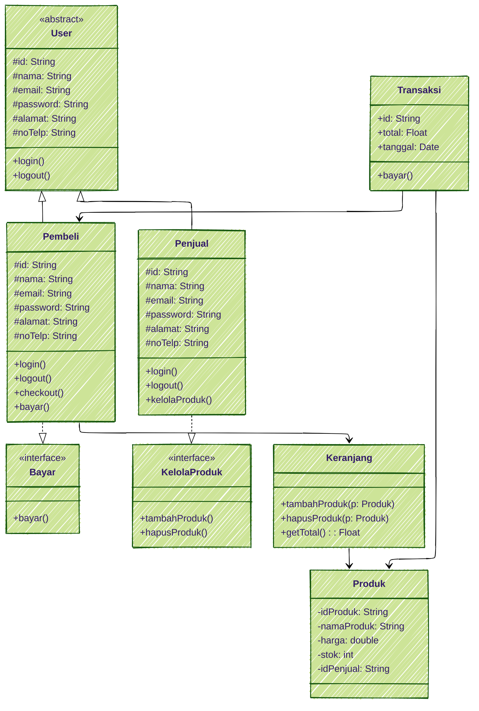

# 🛒 Marketplace Mini

Marketplace Mini adalah aplikasi sederhana berbasis Java yang memungkinkan pengguna untuk:

- Mendaftar sebagai **Pembeli** atau **Penjual**
- Menambahkan dan mengelola **produk**
- Melakukan **pembelian dan pembayaran**
- Melihat dan mengelola **keranjang belanja**

Proyek ini merupakan simulasi sistem e-commerce minimalis dengan fokus pada struktur OOP (Object-Oriented Programming) dan penerapan interface di Java.

## 📸 Demo Video

[](https://www.youtube.com/watch?v=teP3F0WMPvU)

---

## 🧩 Class Diagram



---

## 🚀 Cara Menjalankan

1. Pastikan kamu sudah menginstall **JDK 22** atau versi yang kompatibel.
2. Compile semua file:

```bash
javac -d bin src/**/*.java
```

3. Jalankan program utama:

```bash
java -cp bin app.Main
```

---

## 🧪 Fitur

- Login / Logout
- Pembeli: Lihat produk, tambah ke keranjang, checkout
- Penjual: Tambah / hapus produk
- Transaksi dengan interface `Bayar`
- Total belanja dihitung otomatis di `Keranjang`
- OOP terstruktur dengan pewarisan dan interface

---

## 📓 Changelog

### v1.0.3 - 2025-06-14

- 🚀 Rilis pertama
- ✅ Struktur OOP lengkap
- 🛒 Sistem marketplace dasar
- 🧮 Perhitungan otomatis total keranjang
- 💳 Interface `Bayar` dan `KelolaProduk` diimplementasikan

---

## 📂 Struktur Folder

```
src/
├── app/
│   └── Main.java
├── interfaces/
│   ├── Bayar.java
│   └── KelolaProduk.java
└── models/
    ├── User.java
    ├── Pembeli.java
    ├── Penjual.java
    ├── Produk.java
    ├── Transaksi.java
    └── Keranjang.java
```

---

## 🧠 Konsep OOP yang Digunakan

- Abstraksi: `User` adalah abstract class
- Pewarisan: `Pembeli` dan `Penjual` mewarisi `User`
- Interface: `Bayar`, `KelolaProduk`
- Komposisi: `Keranjang` berisi banyak `Produk`

---

## 🧑‍💻 Author

KELOMPOK 5

---

## 📃 Lisensi

Proyek ini bersifat open-source dan menggunakan lisensi [MIT](LICENSE).
